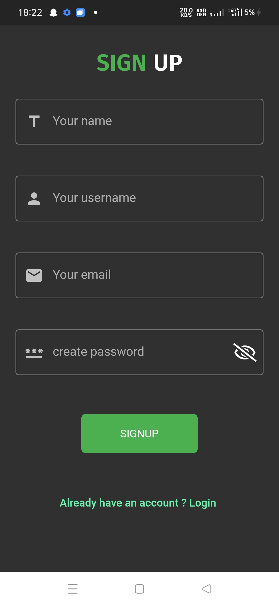
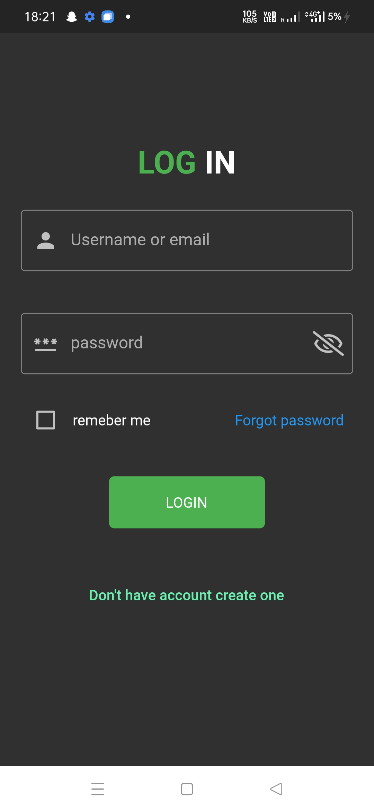
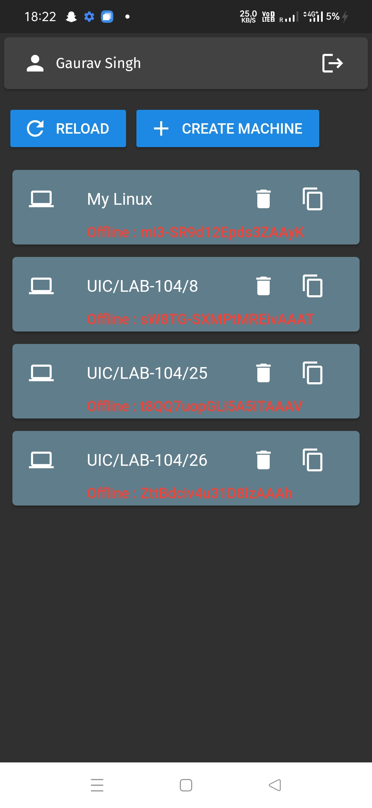
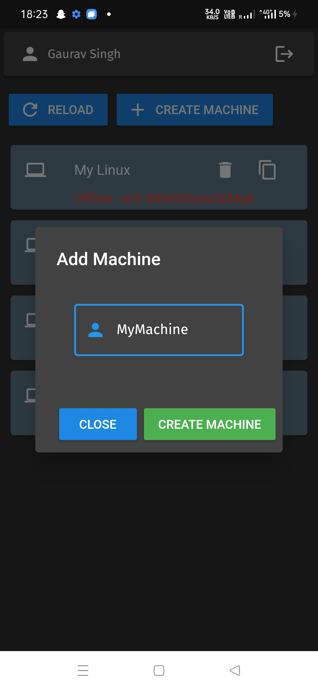
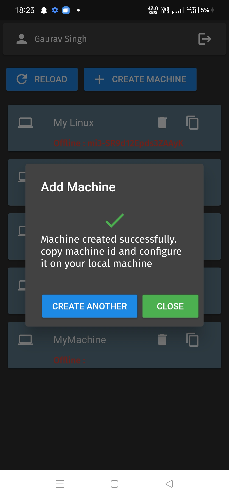
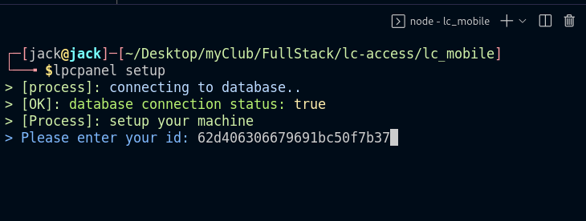
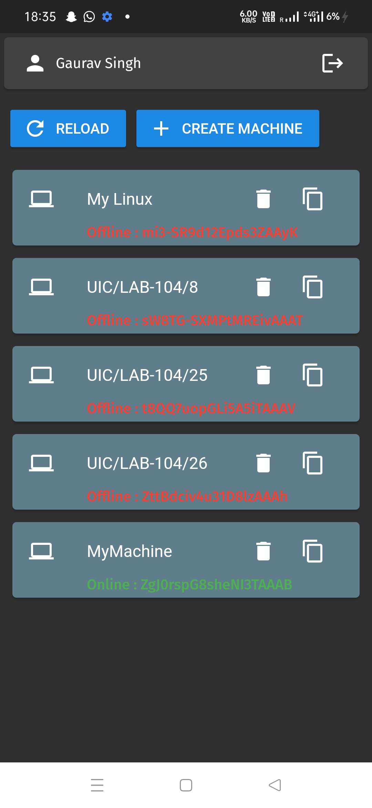
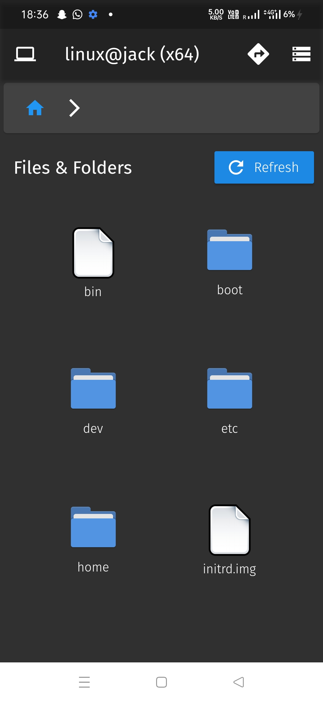

## Information

lpcpanel is a npm package which allows user to control their local computer or laptop
using a android application or a web interface.

You just have to setup it once after that you can access entire filesystem of your local computer or laptop.
This package is a key of that application you have to install this package to use that application.

for download android apk [click here](http://utils.myportfolio.club/lcaccess.apk) or for install it from playstore [click here](https://play.google.com/store/apps/details?id=com.bytecodes.lc_mobile) and also you can use it using web interface through [this link](http://lc-manager.myportfolio.club)

## Setup

Follow instructions for setup this project for your use.
- [Install](https://play.google.com/store/apps/details?id=com.bytecodes.lc_mobile) , [Download](http://utils.myportfolio.club/lcaccess.apk) or use [this link](http://lc-manager.myportfolio.club)

- open registration screen and create a account 


- After registration login your account


- After login you will get home screen


- Now create machine using create machine button


- Now press create button


- Now you can see your machine is create with name MyMachine


- Now you can see copy icon on MyMachine Tile click on it. It will copy you Machine Id on you clip board.

- Now you have to setup lpcpanel package on you laptop or pc which you want to control

```bash
  npm i -g lpcpanel
```

- After installation you have to setup your machine id with this package using this command.
```bash
  lpcpanel setup
```


You see in this image.

- Now start lpcpanel server using command
```
  lpcpanel start
```


- Done lpcpanel setup is completed

Make sure that your laptop is connected to internet.

- Now open lcaccess app or web app and click on refresh button

- Now you see the status of MyMachine from offline to Online:ihcoeupwiewh8fy8ewyfuh


You can see in this image.

- Now press on MyMachine and control you pc or laptop




## Features

- used for controle file system of local computer or laptop
- Create Folder/File
- Delete Folder/File
- Copy Folder/File
- Move Folder/File
- Rename Folder/File


## TODO

- [ ] File/Folder download api integration
- [ ] Public File/Folder Download/Upload link generator api
- [ ] File/Folder Upload api integration

## Tech Stack

**Client:** Flutter, Getx, http, etc

**Server:** Node, Express, pm2, socket.io etc


## Related

Here are some related projects
source code of user-interface lc-manager this project used as client-side of lpcpanel
[lc-manager](https://github.com/frenzycoders/lpcui)

source code of server of lpcpanel which manager all events 
[lpc_server](https://github.com/frenzycoders/lpc-server/)